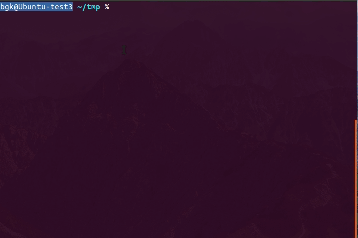

# March 2019

Welcome to the March 2019 Qlik Core update. We're highlighting a couple of important changes and improvements which we
hope you will like.

## Engine security enhancement

Because of a security concern and to follow best-practices, the Qlik Associative Engine Docker image is changing its
user and group from `nobody:nobody` to `1910:1910`. You can read more about using an unique UID/GID here:
[https://docs.docker.com/develop/develop-images/dockerfile_best-practices/#user](https://docs.docker.com/develop/develop-images/dockerfile_best-practices/#user).

**If you are on Mac or Linux and using Docker volume mounts, you may need to change the owner of the volume files. You can
do that with the following command:**

```bash
chown -R 1910:1910 /YOUR-MOUNT
```

The change is effective from Qlik Associate Engine version 12.350.0.

## Introducing hamus.js

We have grown tired of typing the same code every time we create a new react.js solution, so we decided to consolidate
reusable code into a new utility library called [hamus.js](https://github.com/qlik-oss/hamus.js). The repo utilizes
the new React hook API and offers a set of hooks which simplifies simplifies the usage of enigma.js models and layouts,
as well as rendering picasso.js charts based on hypercubes. We will add more hooks as we identify reusable code in
projects, and from feedback. If you have ideas, feel free to share them as issues in the GitHub repository below.

The repo comes with an example to get you started. Check it out at [hamus.js](https://github.com/qlik-oss/hamus.js).

## Usability fixes in catwalk

To increase usability when loading large applications (or with slow connections) we have added a loading screen.


## On the path to a corectl 1.0.0 release

We're in the last phases of finishing a 1.0.0 version of corectl. Focus of this release is to remove the experimental
flag and make the command structure stable. Along with necessary consistency changes in the API we are adding a
couple of requested features in the latest 0.5.0 release.

### Auto completion

To simplify entering commands, arguments and flags, we have added support for bash completion in bash and zsh. Apart
from speeding up when entering commands, it lists available objects for `get` commands (dimension, measure, connection
and object). This will save one call to corectl to retrieve the IDs of the object.



Have a look in the [README](https://github.com/qlik-oss/corectl#usage) for more information on how to enable the
feature.

### Better error messages and examples

The corectl documentation has been improved with better error messages and more examples for the different commands.
As an example, take a look at the new [Examples chapter](https://github.com/qlik-oss/corectl#examples) in the README,

### Smaller fixes

Together with the larger features we have fixed smaller issues such as:

* allowing for passing username and password to connectors in the config file
* better error messages when failing to create an application
* notify the user of a new corectl versions when running the version command
* allow for removing multiple connections through `remove connections`

As always, you can follow the development in the [corectl repo](https://github.com/qlik-oss/corectl).

## Upcoming

In April, we will release corectl as 1.0.0 and look further into our connector offerings.
Stay tuned!

* [slack #qlik-core](https://qlik-branch.slack.com/channels/qlik-core)
* [github](https://github.com/qlik-oss)
